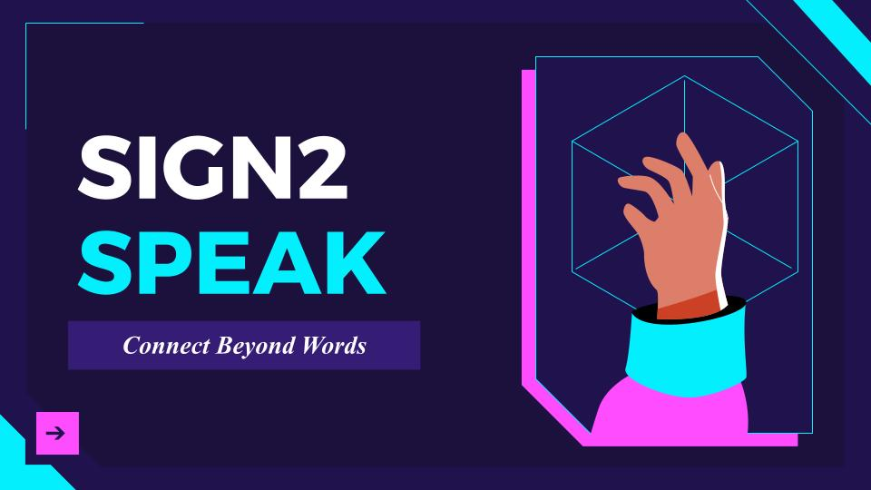

<h1 align="left">Sign2Speak: ASL-to-Speech Translator</h1>

###

<h3 align="left">What is Sign2Speak?</h3>

###

This application aims to bridge the disparity between hearing-impaired individuals who use sign language and the general public by providing a platform for sign language translation and literacy.

###
<h3> Features </h3>

#### 1. Sign Language Translation
- The application **reads out** American Sign Language (ASL) using **Google Text-to-Speech (Gtts)**, helping non-signers understand what is being signed in real time.

#### 2. Minimum Viable Product (MVP) – ASL Alphabet Translation
- Our **MVP** focuses on the **ASL alphabet**, allowing users to sign and **spell out individual words**.
  
#### 3. Scalable Translation
- In future iterations, the tool will be scaled to support the translation of **entire words and phrases**, enabling **seamless communication** between sign language users and non-users.
  
#### 4. Educational Tool for Sign Language Literacy
- The application doubles as an **educational tool**, providing users the opportunity to **learn sign language**, making it accessible to a broader audience and promoting **sign language literacy**.

#

.jpg)
.jpg)
.jpg)
#

### 🏆 [StudentHack GDSC 2nd Place Winner](https://www.linkedin.com/posts/gdscmanchester_gdsc-studenthack2024-accessibility-ugcPost-7204026470883545088-JtxO?utm_source=share&utm_medium=member_desktop)